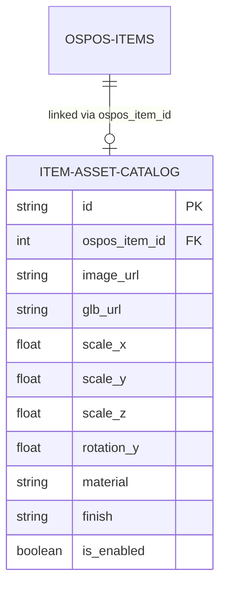

# TileVista & OSPOS Catalog Integration Guide

This document provides a guide for team members regarding the inventory integration between the TileVista virtual 3D showroom console and the legacy OSPOS cashier/Point of Sale register system.

---

## 1. Architectural Strategy

OSPOS is the **authoritative inventory source of truth**. All stock updates, cashier sales, pricing adjustments, item names, category taxonomies, and SKU classifications must be managed inside OSPOS. The local database explicitly does not store categories.

### Database Division
* **OSPOS Database (`ospos`):** Manages `ospos_items` (items list, SKU codes, descriptions, and standard pricing) and `ospos_item_quantities` (real-time physical showroom stock).
* **TileVista Database (`tilevista_db`):** The `Product` table has been removed. A new `item_asset_catalog` table manages ONLY the visual design configurations and 3D GLB model specifications linked to OSPOS articles:



---

## 2. Backend API Integration & Routing

All backend endpoints are routed through the NestJS gateway.

### Data Aggregation Layer
The backend `ProductsService` fetches live listings from the legacy OSPOS API and merges them with the `ItemAssetCatalog` entries on the fly. The final unified payload is returned to the frontend as a `UnifiedItemDto` array.

### Endpoints Matrix
| Method | Endpoint | Access Level | Description |
|---|---|---|---|
| **GET** | `/api/items` | Public | Returns all active showroom items mapped with their 3D/media assets. |
| **GET** | `/api/items/:id` | Public | Returns a single item merged with its asset configurations. |
| **GET** | `/api/admin/items` | Admin | Returns the complete catalog with image and GLB file status badges. |
| **PUT** | `/api/admin/items/:id/asset` | Admin | Creates or updates rotation, tags, materials, and scaling assets. |
| **POST** | `/api/admin/items/:id/upload-image` | Admin | Uploads an image. File is renamed using a slug of its item name. |
| **POST** | `/api/admin/items/:id/upload-glb` | Admin | Uploads a `.glb` 3D model file, renaming it appropriately. |
| **GET** | `/api/inventory` | Admin | Returns real-time stock levels synced live from OSPOS. |

---

## 3. Frontend Implementation Standards

### 1. Unified Page Margins & UI Consistency
All dashboard panels under `/admin/*` must inherit layout metrics from the parent `AdminLayout` wrapper:
* Do not wrap root page containers in additional paddings (`p-8`), backgrounds (`bg-[#F9F9F7]`), or height limits (`min-h-screen`). 
* Use `<div className="font-sans space-y-6">` as the root element.
* Standardize page headers with the following typography hierarchy:
```tsx
<div>
  <span className="text-[9px] font-bold tracking-widest text-[#D4C5B9] uppercase">Store Console</span>
  <h1 className="text-3xl font-semibold tracking-tight text-[#1A1A1A] mt-1.5">Page Title</h1>
  <p className="text-xs text-gray-500 font-light mt-1">Page description text.</p>
</div>
```

### 2. Form Dialog Overlay Standard (Modals)
Instead of split-screen side-drawers which break page layout margins:
* Display editing elements in a fixed centered modal overlay using a blurred dark backdrop:
```tsx
{isOpen && (
  <div className="fixed inset-0 z-50 flex items-center justify-center bg-black/50 backdrop-blur-xs p-4 overflow-y-auto">
    <div className="bg-white border border-gray-200 w-full max-w-2xl p-8 shadow-2xl relative max-h-[90vh] overflow-y-auto">
      {/* Modal Contents */}
    </div>
  </div>
)}
```

---

## 4. Local Setup & Seeding

### 1. Database Seeding
To seed the database with mock administrators (`admin@tilevista.com` / `admin123`) and customer entries:
```bash
# Execute CommonJS script in backend directory
node database/prisma/seed.cjs
```

### 2. Running Dev Servers
Start the full stack from the monorepo root:
```bash
# Start Next.js App
npm run dev:frontend

# Start NestJS API
npm run dev:backend
```
